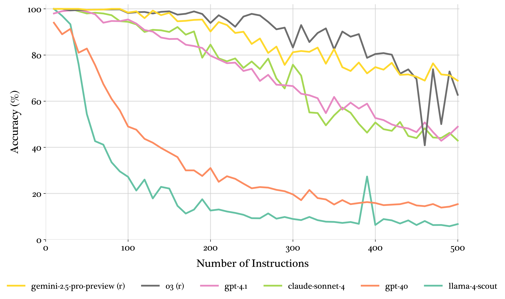

# How Many Instructions Can LLMs Follow at Once?

* **Publication Date:** 2025-07-25
* **Link**: https://arxiv.org/abs/2507.11538
* **Authors/Institutions:** Daniel Jaroslawicz, Brendan Whiting, Parth Shah, Karime Maamari from Distyl.ai

## Actionable insights

### 1. Adopt "Reasoning" Models for Complex Coding Tasks
If your coding agent needs to adhere to complex constraints (e.g., strict styling guidelines, architecture rules, specific library versions, and test requirements), you should prioritize reasoning models over general-purpose ones. 
* **Insight**: Models like `gemini-2.5-pro` and `o3` exhibit a "threshold decay" pattern, meaning they maintain near-perfect instruction adherence until they hit a critical density threshold. 
* **Action**: Default to frontier reasoning models for your heavy-lifting agentic loops rather than standard models, which often suffer from rapid linear or exponential degradation under cognitive load.

### 2. Cap Context at ~150 Instructions & Decompose Tasks
While context windows have grown massive, cognitive limits still exist. Even the absolute best frontier models cap out at around 68% accuracy when bombarded with 500 instructions. 
* **Insight**: Top reasoning models maintain near-perfect performance through about 150 instructions before performance systematically declines and variance increases.
* **Action**: Do not dump an entire monolithic codebase's rules, linters, and user requests into a single prompt. Decompose large agentic tasks into a pipeline. For example, have one agent write the core logic, a second agent apply security constraints, and a third agent enforce formatting rules.

### 3. Put Critical Constraints First (The Primacy Effect)
The paper notes that models suffer from position bias, universally displaying a "primacy effect". 
* **Insight**: Instructions presented earlier in the prompt receive more attention than those buried in the middle or end.
* **Action**: Place absolute non-negotiables (e.g., "Do not delete the production database", "Use SQL parameterized queries", or core architectural patterns) at the very beginning of your system prompt. Do not leave crucial security or operational instructions for the end. 

### 4. Build Robust Post-Generation Verification
When an LLM becomes overloaded with too many instructions, how does it fail? 
* **Insight**: The paper found that models overwhelmingly default to *omission errors* (completely failing to include or address a requirement) rather than *modification errors* (addressing it incorrectly) as instruction density scales.
* **Action**: Because agents will "silently drop" constraints when overwhelmed, you cannot assume an instruction was followed just because the code runs. You must implement programmatic validation (like unit tests, linters, or a secondary "LLM-as-a-judge" evaluation step) to verify that all prompt requirements are actually present in the generated code.

### 5. Architect Around Severe Latency Spikes
If you are building an interactive coding assistant (like Copilot), speed matters. 
* **Insight**: The latency of reasoning models increases dramatically under heavy cognitive load. For instance, the `o3` model scaled from 26.30 seconds at 10 instructions up to 219.58 seconds at 250 instructions.
* **Action**: Use general-purpose models for low-latency, real-time developer interactions (like inline autocomplete), as their latency remains stable. Reserve high-instruction reasoning models for asynchronous, background agentic workflows (like automated PR reviews or sweeping codebase refactors) where a 3+ minute wait time is acceptable.

### 6. Watch for "Core Task" Degradation 
Pushing models to their limit to follow arbitrary instructions can break the actual code they are supposed to write.
* **Insight**: At high instruction densities, certain top models (`o3`, `o4-mini`) showed marked declines in overall output coherence and a reluctance to generate a large amount of tokens.
* **Action**: Be careful of prompt bloat. If you force an agent to track hundreds of hyper-specific micro-rules, it may lose the plot entirely and generate incomplete, truncated, or logically flawed code. Keep prompts lean to preserve the model's core reasoning quality.

## Core Concepts & Taxonomy & Relationship

Based on the research paper, here are additional insights categorized by new concepts, classifications, and relationships regarding how LLMs process instructions under heavy cognitive load:

### 1. Classification of Performance Degradation Patterns

The researchers identified three distinct ways models fail as instruction density scales:
* **Threshold Decay**: Performance remains perfectly stable until a critical threshold is reached, after which the model transitions to a steep degradation slope with high variance. This pattern is characteristic of top reasoning models like `o3` and `gemini-2.5-pro`.
* **Linear Decay**: The model experiences a steady, predictable, and proportional decline in performance across the entire density spectrum. This behavior is exemplified by standard frontier models like `gpt-4.1` and `claude-3.7-sonnet`.
* **Exponential Decay**: The model suffers a rapid, steep performance drop almost immediately at low densities. This is typically seen in smaller models like `claude-3.5-haiku` and `llama-4-scout`.

### 2. Classification of Instruction-Following Errors
When models fail to follow rules, their failures are classified into two distinct types:
* **Omission Errors**: A complete failure to include the required constraint anywhere in the text. As instruction density increases, models universally default to this error type, silently abandoning instructions.
* **Modification Errors**: The model attempts to follow the instruction but alters it, such as using a morphological variant (e.g., generating the word "accountable" when the strict instruction was to use "accountability"). 

### 3. Classification of Variance (Reliability) Patterns
By measuring the variance across multiple runs, the paper classifies models into three transitional cognitive load states:
* **Top-tier Models**: Display steady increases in variance as density scales, indicating that their reliability degrades progressively as they are pushed to extremes.
* **Mid-tier Models**: Exhibit mid-range variance peaks (typically between 150-300 instructions). This represents a "critical capacity zone" where the model's performance becomes highly unstable right before it completely collapses under the cognitive load.
* **Worst-performing Models**: Show steadily decreasing variance, meaning they quickly stabilize at being consistently poor.

### 4. Concept of "Accuracy Floors"
* For models that exhibit the exponential decay pattern, accuracy does not drop completely to zero.
* Instead, performance asymptotically levels off to a consistent baseline. This suggests there is an "accuracy floor" or lower bound of instruction satisfaction that hovers around 7-15%, even for the weakest models under maximum load.

### 5. Relationships Between Model Attributes and Performance
The study highlights the relationship between model architecture (size, age, reasoning) and output capability:
* **The General Rule**: Larger models outperform smaller models, newer models outperform older models, and reasoning models outperform general-purpose models up to critical density thresholds.
* **The Outliers (Broken Relationships)**: The paper notes exceptions that challenge these general trends. For instance, `grok-3` achieved performance nearly on par with the reasoning model `o3` despite not being run in reasoning mode. Conversely, `gpt-4o` showed surprisingly weak performance, decaying rapidly in a manner characteristic of much smaller, older models.