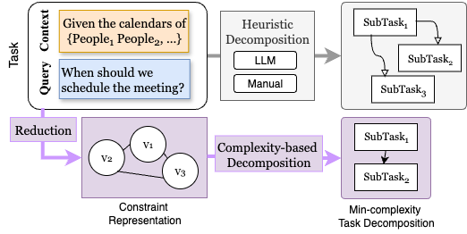

# An Approach for Systematic Decomposition of Complex LLM Tasks

* **Publication Date:** 2025-10-13
* **Link**: https://arxiv.org/pdf/2510.07772v2
* **Authors/Institutions:** Columbia University

## Actionable Insights

### 1. Systematic vs. Heuristic Task Decomposition
* **Insight**: Large Language Models (LLMs) suffer from reliability issues on complex multi-step tasks because existing decomposition methods (like Chain-of-Thought) rely on heuristics rather than mathematical principles. The research introduces the ACONIC framework, which models tasks as constraint satisfaction problems (CSPs) and uses formal complexity measures (like treewidth) to guide the decomposition. By doing so, agents can improve task completion accuracy by 9% to 40%.
* **Action**: Instead of relying solely on LLMs to heuristically chunk their own workflows via prompt engineering, architect your orchestration layer to parse complex environments (such as large database schemas) into mathematical constraint graphs. Programmatically partition these graphs into minimal subtasks before querying the LLM.

### 2. Leveraging Treewidth for Context Window Optimization
* **Insight**: In constraint processing, "treewidth" (the maximum size of a grouped subproblem or "bag") accurately defines the intrinsic frontier of difficulty for an LLM. The research proves that establishing local consistency over minimized subgraphs guarantees the global satisfiability of the entire complex problem.
* **Action**: When designing RAG or agentic logic for highly combinatorial tasks (like Natural Language to SQL), do not feed the entire context or schema to the model at once. Decompose the schema into subgraphs with minimized complexities, and feed the agent one local schema subset at a time, carrying over only the output dependencies from previous related subtasks.

***

## Core Concepts & Patterns & Taxonomy

| Concept / Pattern | Description | Key Research Finding |
| :--- | :--- | :--- |
| **Heuristic Decomposition** | Traditional methods that rely on LLMs or domain experts to manually or intuitively break a task into workflows. | These approaches lack a principled measure of task complexity and often fail when combinatorial complexity increases. |
| **Complexity-based Decomposition** | A systematic approach that reduces tasks into a constraint satisfaction problem to minimize problem complexity. | Consistently pushes the frontiers of task difficulty outward, allowing agents to successfully complete significantly more complex tasks. |
| **Planning as Satisfiability (PaS)** | A framework that transfers world states and actions into finite state abstractions involving propositional fluents, actions, and goal states. | Enables the agent's task to be formulated mathematically as determining a valid sequence of actions that transition states toward a goal. |
| **Tree Decomposition** | A method to partition a constraint graph into subproblems ("bags") where local variable assignments don't violate prior clauses. | Minimizing the maximum bag size (treewidth) is crucial, as local consistency over these minimal subtasks seamlessly preserves global satisfiability. |

### Taxonomy of Constraint-Induced Task Reduction
The ACONIC research classifies the systematic reduction of complex LLM tasks into a rigorous three-step theoretical pattern:

* **Step 1: Reduction to Planning Problems**: The agent's task is initially modeled using a state-based framework that defines finite sets of propositional fluents (facts about the world), available actions (with specific preconditions and effects), and desired goal states.
* **Step 2: Reduction to Constraint Satisfaction Instances (CSP)**: The planning problem is converted into a CSP by mathematically encoding the preconditions, add effects, and delete effects of each action as Boolean dependent constraints. This step deliberately ensures frame consistency so that logic states only change via valid action triggers.
* **Step 3: Graph Structuring & Minimization**: The resulting CSP variables and constraints are mapped into an undirected constraint graph. The framework then applies tree decomposition algorithms to minimize the graph's treewidth, effectively splitting a massive, computationally expensive global problem into isolated, easily solvable local workflows.